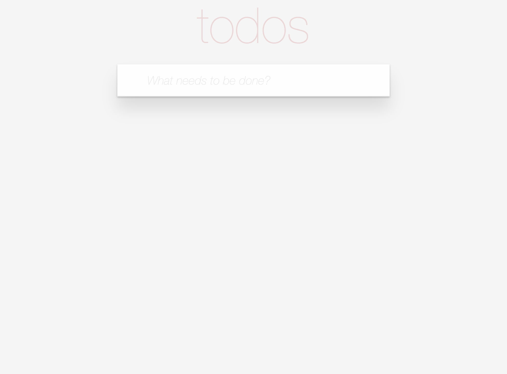

# Apollo + React Todo MVC

1. `create-react-app apollo-todomvc`
2. `yarn start`

## [Spec](https://github.com/tastejs/todomvc/blob/master/app-spec.md#functionality)

### ✅ No todos 

When there are no todos, `#main` and `#footer` should be hidden.

### ☑️ New todo

New todos are entered in the input at the top of the app. The input element should be focused when the page is loaded, preferably by using the `autofocus` input attribute. Pressing Enter creates the todo, appends it to the todo list, and clears the input. Make sure to `.trim()` the input and then check that it's not empty before creating a new todo.

### ☑️ Mark all as complete

This checkbox toggles all the todos to the same state as itself. Make sure to clear the checked state after the "Clear completed" button is clicked. The "Mark all as complete" checkbox should also be updated when single todo items are checked/unchecked. Eg. When all the todos are checked it should also get checked.

### ☑️ Item

A todo item has three possible interactions:

1. Clicking the checkbox marks the todo as complete by updating its `completed` value and toggling the class `completed` on its parent `<li>`

2. Double-clicking the `<label>` activates editing mode, by toggling the `.editing` class on its `<li>`

3. Hovering over the todo shows the remove button (`.destroy`)

### ☑️ Editing

When editing mode is activated it will hide the other controls and bring forward an input that contains the todo title, which should be focused (`.focus()`). The edit should be saved on both blur and enter, and the `editing` class should be removed. Make sure to `.trim()` the input and then check that it's not empty. If it's empty the todo should instead be destroyed. If escape is pressed during the edit, the edit state should be left and any changes be discarded.

### ☑️ Counter

Displays the number of active todos in a pluralized form. Make sure the number is wrapped by a `<strong>` tag. Also make sure to pluralize the `item` word correctly: `0 items`, `1 item`, `2 items`. Example: **2** items left

### ☑️ Clear completed button

Removes completed todos when clicked. Should be hidden when there are no completed todos.

### ☑️ Persistence

Your app should dynamically persist the todos to localStorage. If the framework has capabilities for persisting data (e.g. Backbone.sync), use that. Otherwise, use vanilla localStorage. If possible, use the keys `id`, `title`, `completed` for each item. Make sure to use this format for the localStorage name: `todos-[framework]`. Editing mode should not be persisted.

### ☑️ Routing

Routing is required for all implementations. If supported by the framework, use its built-in capabilities. Otherwise, use the  [Flatiron Director](https://github.com/flatiron/director) routing library located in the `/assets` folder. The following routes should be implemented: `#/` (all - default), `#/active` and `#/completed` (`#!/` is also allowed). When the route changes, the todo list should be filtered on a model level and the `selected` class on the filter links should be toggled. When an item is updated while in a filtered state, it should be updated accordingly. E.g. if the filter is `Active` and the item is checked, it should be hidden. Make sure the active filter is persisted on reload.